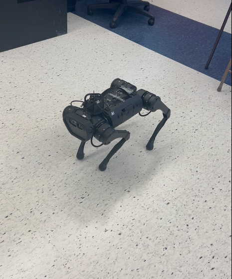
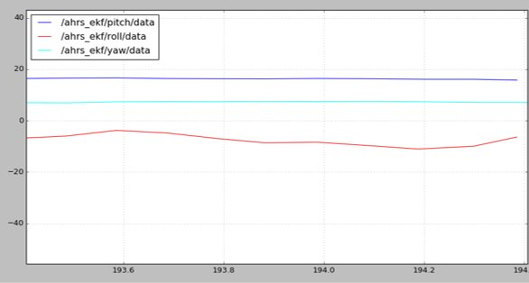

# ahrs_ekf
A python implementation of an AHRS (Attitude and Heading Reference System) Extended Kalman Filter. This was completed as a final project for MECH 7710 (Optimal Estimation). First, the algorithm was written and tested in Matlab. Then, the python class in ahrs_ekf.py was used within a ROS2 node to determine and display the heading, pitch and roll of a Unitree quadraped robotic dog in real-time.

## Test Platform
The test platform was a Unitree quadruped robot equipped with a Sparkfun IMU.

An example of the filter output in degrees while rolling the already pitched body of the dog is shown below. The heading result was validated by comparing to the heading from an iPhone compass app.

## References
[1] https://ahrs.readthedocs.io/en/latest/filters/ekf.html