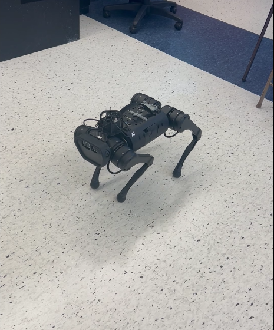
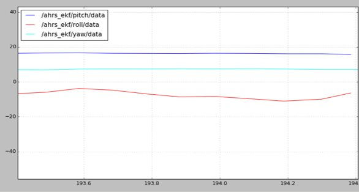

# ahrs_ekf
A python implementation of an AHRS (Attitude and Heading Reference System) Extended Kalman Filter. This was completed as a final project for MECH 7710 (Optimal Estimation). First, the algorithm was written and tested in Matlab. Then, the python class in ahrs_ekf.py was used within a ROS2 node to determine and display the heading, pitch and roll of a Unitree quadraped robotic dog in real-time.

## Test Platform
The test platform was a Unitree quadruped robot equipped with a Sparkfun IMU.

An example of the filter output in degrees while rolling the already pitched body of the dog is shown below. The heading result was initially validated by comparing to the heading from an iPhone compass app.

## Issues and Improvements
This filter propagates the covariance for all four quaternion elements, which worked well in practice during this demonstration and matched the material we found online at the time. However, this method is not mathematically correct, as you're maintaining one more row/column in the covariance matrix than there are rotational degrees of freedom. In other words you fundamentally have uncertainty only on the rotation about the three axes. Another way to see the problem is that the quaternion has a unit norm constraint, effectively removing one degree of freedom. For this reason, the covariance matrix in this formulation is rank deficient and can lead to numerical issues. A correct method using the Multiplicative Extended Kalman Filter (MEKF) intended for spacecraft can be found in [2].

## References
[1] https://ahrs.readthedocs.io/en/latest/filters/ekf.html

[2] Markley, F. L. and Crassidis, J. L., Fundamentals of Spacecraft Attitude Determination and Control. 2014. doi:10.1007/978-1-4939-0802-8.
